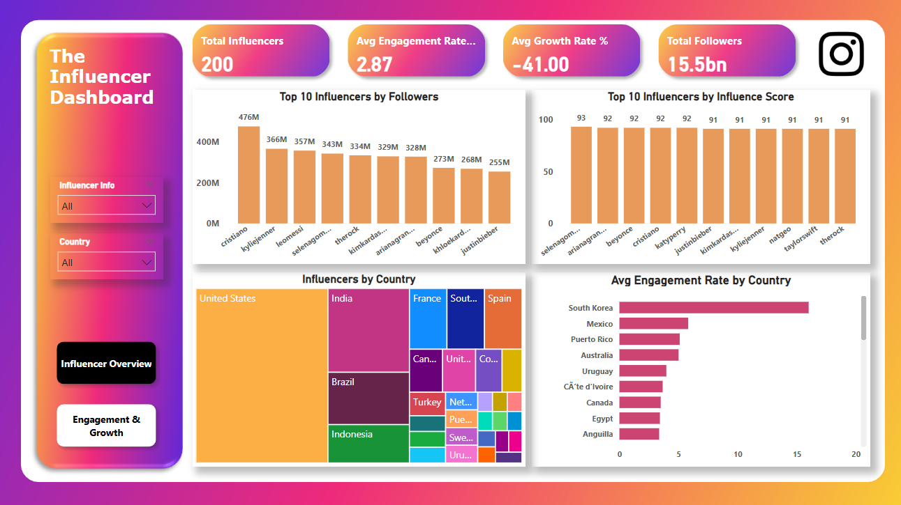
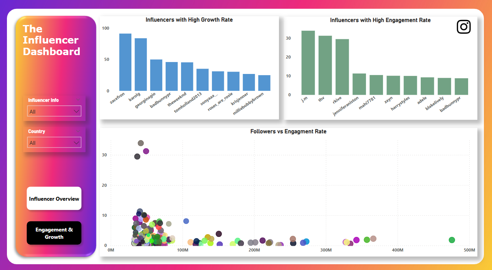

# Project -> Influencer-Analysis
A business analytics case study exploring influencer performance metrics using Python &amp; Power BI, including follower growth, engagement rate, and country-wise audience insights.

## Table of Contents
- [Objective](#objective)
- [Business Questions Answered](#business-questions-answered)
- [Data Cleaning & Preparation](#data-cleaning--preparation)
- [Key Performance Indicators (KPIs)](#key-performance-indicators-kpis)
- [Dashboards Overview](#dashboards-overview)
- [Key Insights](#key-insights)

## Objective
The objective was to evaluate the company's supply chain operations using a data-driven approach to:

- Identify inefficiencies in transportation and supplier performance
- Minimize operational and delivery costs
- Improve product quality and inspection turnaround
- Optimize inventory management across SKUs
  
**Tools used:** PowerBI • Excel • GitHub

### Business Questions Answered

1. Which product categories and customer segments drive the most revenue?
2. How efficient and cost-effective are our logistics and transportation modes?
3. What is the current state of product quality and manufacturing efficiency?
4. Which suppliers or locations are performing best in terms of cost, quality, and speed?
5. Are there inefficiencies in our inventory management and product movement?

### Data Cleaning & Preparation
- Cleaning & preparation of data was performed in python.
- Removed percentage symbols from 60_day_engagement_rate and converted to decimal.
- Handled missing values in country by researching influencer locations.
- Standardized numeric columns (followers, likes, etc.) and fixed data types.
- Created new calculated fields:
  1. Engagement Rate (%) = (avg_likes / followers) * 100
  2. Growth Rate (%) = ((new_post_avg_like - avg_likes) / avg_likes) * 100
- Labeled unknown countries as "Unknown" for optional filtering in dashboards.
- Saved the cleaned dataset as top_insta_influencers_updated.xlsx.

### Key Performance Indicators (KPIs)
| KPI                             | Description                                         |
| ------------------------------- | --------------------------------------------------- |
| **Total Influencers**           | Count of influencers analyzed (200 records)         |
| **Total Followers**             | Combined follower base across all influencers       |
| **Average Engagement Rate (%)** | Average engagement rate across dataset              |
| **Average Growth Rate (%)**     | Average growth in likes for new posts               |

### Dashboards Overview

Two interactive dashboards were created in Power BI:

#### Influencer Overview

#### Engagement & Growth

### Key Insights
1. Total Followers: 15.5 Billion | Total Influencers: 200
2. Average Engagement Rate: 2.87% — smaller influencers (<50M followers) tend to outperform mega influencers.
3. Cristiano Ronaldo is the most-followed influencer (475M followers).
4. j.m & thv have the highest engagement rates (35% and 33%) despite smaller audiences.
5. South Korea leads in audience engagement (~17%), followed by Mexico and Puerto Rico.
6. The average growth rate across influencers is -41%, indicating declining engagement for some large accounts.
7. Zac Efron (+91%) and Karol G (+83%) show exceptional follower engagement growth.
8. Outliers identified: Mega influencers with low engagement (e.g., katyperry, snoopdogg).

### Project Highlights
- Focused on business storytelling with dynamic filters for country, engagement, and follower size.
- Used Python for EDA and Power BI for interactive dashboards.
- Designed for marketing teams to identify high-ROI influencers.

